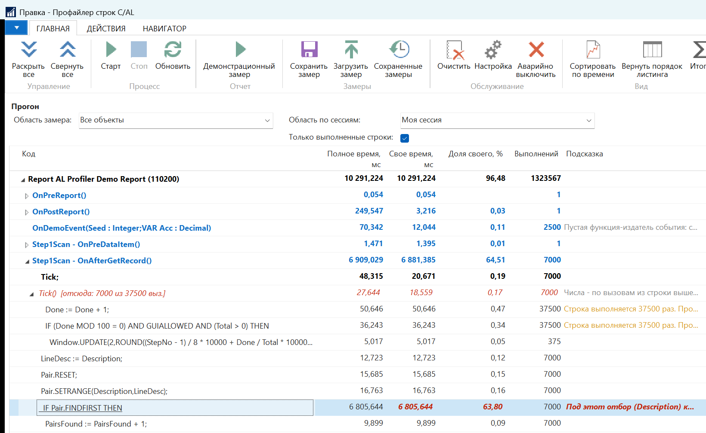
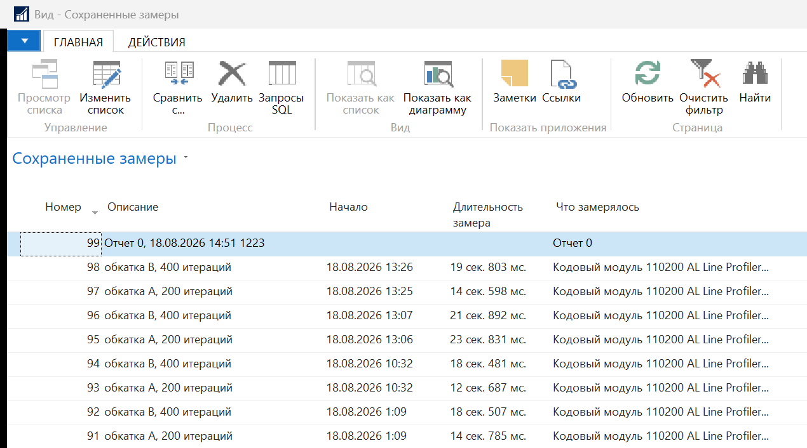
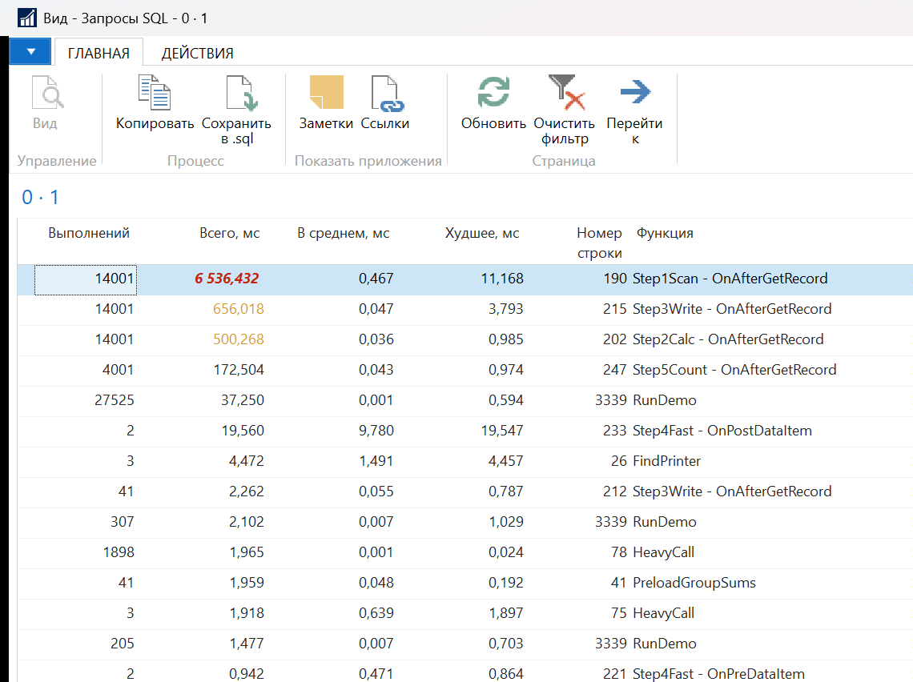
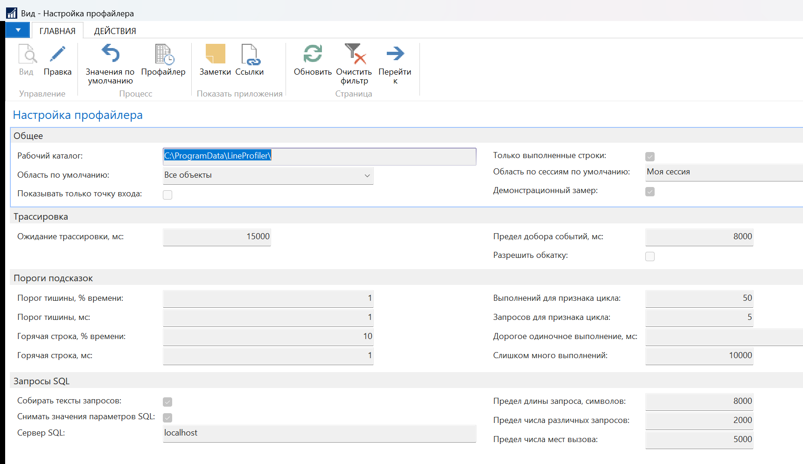

# Построчный профайлер C/AL

Профайлер кода для **Microsoft Dynamics NAV 2018** (C/SIDE, C/AL). Показывает листинг
объекта, в котором у каждой строки кода стоят её длительность, число выполнений, время
в SQL и подсказка по оптимизации.

Живёт внутри NAV: обычная страница плюс приёмник ETW в процессе службы. Ни агента на
рабочей станции, ни внешнего профайлера не нужно.

Разрабатывался и обкатан на NAV 2018; пакет установки рассчитан и на NAV 2017 — см.
[Статус](#статус).

## Зачем

Когда операция в NAV тормозит, штатных средств два, и оба отвечают не на тот вопрос.

| Инструмент | Что даёт | Чего не даёт |
|------------|----------|--------------|
| `Page 9990 Code Coverage` | выполнялась ли строка и сколько раз | времени нет вовсе — горячая строка выглядит как любая другая |
| `EtwPerformanceProfiler` | дерево вызовов: какая функция дорогая | внутри функции на 200 строк не видно, какая именно строка съела время |
| этот профайлер | время, выполнения, SQL и подсказку **на каждой строке**, плюс провал по вызовам деревом | не заменяет замеры на стороне SQL Server и не профилирует .NET |

Замер идёт по живому сценарию: нажали «Старт», отработали в клиенте то, что тормозит,
нажали «Стоп» — и получили листинг, отсортированный по времени.

Как это устроено: листинг и число выполнений даёт сама платформа через виртуальную
`Table 2000000049 Code Coverage`; время берётся из событий ETW провайдера
`Microsoft-DynamicsNAV-Server`, которые слушает свой приёмник на C# внутри процесса
службы; склейка идёт по «тип объекта + код объекта + номер строки». Агрегация живёт
в приёмнике: событие приходит на каждый выполненный оператор — это сотни тысяч событий
за минуту работы, и отдавать их в C/AL поштучно нельзя.

## Что умеет

**Чью работу мерить.** Свою сессию, указанную чужую (по списку активных сеансов) или
все сессии экземпляра сервера. Область — все объекты или один конкретный.

**Листинг с временами.** Полное время, своё время, доля от прогона, число выполнений,
максимум одного выполнения, время в SQL и число запросов. «Своё время» строки вызова
не включает вызванную функцию — сводит дерево колонка полного времени. Сортировка либо
по времени, либо в порядке исходника.

**Провал внутрь вызовов.** Со строки можно провалиться в вызванную функцию: вид
собирается деревом, родительский код остаётся на экране, соседние вызовы раскрываются
независимо. Числа заголовка функции при этом показываются **по вызовам из той строки,
откуда пришли** — с пометкой вида «отсюда: N из M выз.». Прямая рекурсия
раскрывается тоже: полное время берётся с внешнего витка, чтобы вложенные не считались
дважды. Подписчики событий открываются со строки издателя.

**Сохранение и сравнение.** Замер сохраняется целиком и сравнивается с другим строка
к строке, с дельтой в миллисекундах и процентах. Строки сопоставляются **по тексту**,
а не по номеру: после перекомпиляции номера уезжают.

**Запросы SQL.** Со строки видно, какие запросы она породила: текст, число выполнений,
время. Запрос отдаётся готовым к вставке в SSMS — с блоком `DECLARE`, типы в котором
взяты из метаданных NAV. Настоящие значения параметров платформа не отдаёт вовсе;
их можно снять сеансом расширенных событий SQL Server — это отдельная возможность,
**по умолчанию выключенная** (нужны права, см. [Требования](#требования)). Без неё
в `DECLARE` стоит `NULL`.

**Советник по ключам.** На дорогой строке вместо общего «вынесите из цикла» звучит
причина. Отбор разбирается из фактического текста запроса, ключи читаются с таблицы
во время выполнения, поля — из метаданных. Шесть вердиктов: под отбор ключа нет;
ключ есть, но выключен; готового нет, но подходящий можно дописать в конец; ни отбора,
ни сортировки — перебор задуман; условия есть, но в индекс не ложатся; покрыто.
Каждый совет предупреждает, что новый ключ меняет порядок обхода — проверять надо
не скорость, а совпадение результата.

**Подсказки по неоптимальному коду.** Обращение к БД в цикле, `CALCFIELDS` в цикле,
чтение записи на каждой итерации (`FINDSET` внутри цикла отличается от одиночного
чтения), `COUNT` вместо `ISEMPTY`/`CALCSUMS`, запись в цикле, дорогое одиночное
выполнение, слишком много выполнений. У каждой подсказки есть важность, и все пороги
вынесены в настройку: без гейта по цене подсказки сыпались бы на холодном коде.

**Здоровье замера.** Отдельная строка итогов говорит, что приёмнику пришлось чинить
при разборе: потерянные события, незакрытые кадры, операции SQL без начала, оборванные
ошибкой функции, замеры, не легшие на листинг. Всё, кроме «замечаний нет», делает
тайминги приблизительными — и это видно сразу, а не выясняется потом.

**Демонстрационный замер.** Кнопка на странице готовит себе собственные данные,
прогоняет по ним демонстрационный отчёт и меряет его построчно. Девять шагов: поиск
без ключа, поле потока в цикле, построчная запись, то же самое написанное правильно,
`COUNT` в цикле, склейка строки в цикле, десять вложенных процедур, подписчик события,
тяжёлый вызов в тесном цикле. Ваших данных демонстрация не касается — работает на любой
базе и годится как проверка после установки.

**Встроенная обкатка.** Запуск `Codeunit 110200` (при снятой галке в настройке ничего
не делает) прогоняет всю цепочку без клиента: два замера с разной нагрузкой, сохранение,
сравнение, разбор запросов — и печатает вердикт «пройдено N из M» первой строкой.

## Как это выглядит

Снимки сделаны на демонстрационном замере: профайлер меряет собственный `Report 110200`
по собственным демо-таблицам, поэтому в кадре нет ничего, кроме объектов самого
инструмента.



Дерево раскрывается от объекта к триггерам и дальше к отдельным операторам C/AL.
Красным помечена горячая строка: `IF Pair.FINDFIRST THEN` забрала 63,8 % своего
времени при 7000 выполнениях, и подсказка называет причину — под этот отбор ключа
нет, читается вся таблица целиком.



Замер сохраняется целиком и открывается позже — или сравнивается с другим, чтобы
увидеть, что правка ускорила код, а не переложила время в соседнюю строку.



Запросы, ушедшие в SQL за время замера: сколько раз, сколько всего и худшее время,
и главное — из какой функции и с какой строки они ушли.



Пороги подсказок, пределы сбора и рабочий каталог. Значения по умолчанию
проставляются сами — до первого замера сюда ходить не нужно.

## Требования

| Что | Подробности |
|-----|-------------|
| Платформа | NAV 2018 (build 11.x). Пакет установки рассчитан и на NAV 2017; проверка там ещё не проводилась |
| Разработка | классический C/SIDE, C/AL. Расширений AL нет и не будет |
| .NET | .NET Framework 4.x на сервере; приёмник собирается `csc.exe` из `C:\Windows\Microsoft.NET\Framework64\v4.0.30319` |
| Зависимость | `Microsoft.Diagnostics.Tracing.TraceEvent.dll` — уже лежит на сервере, в поставке NAV (`Service\Add-ins\NavEtwReceiver`). В репозиторий она не входит, см. [THIRD-PARTY-NOTICES.md](THIRD-PARTY-NOTICES.md). Других внешних библиотек нет |
| Конфиг инстанции | `EnableFullALFunctionTracing = true`. Без него событие оператора не шлётся вовсе и замер выходит пустым. В NAV 2017 переключение требует **перезапуска инстанции** |
| Права на ETW | сессию ETW заводит учётная запись **службы**, а не тот, кто нажал кнопку. Годится системная учётка либо членство в группе `Performance Log Users` (SID `S-1-5-32-559`) |
| Права на файловую систему | запись в `Add-ins` службы (только при установке) и в рабочий каталог профайлера, по умолчанию `C:\ProgramData\LineProfiler\` |
| Лицензия NAV | объекты живут в диапазоне `110200..110208` — он должен быть разрешён вашей лицензией разработки |
| Права SQL (необязательно) | только для съёма значений параметров запросов: `ALTER ANY EVENT SESSION` и `VIEW SERVER STATE` учётке службы. Возможность выключена по умолчанию, без неё профайлер работает целиком |

## Установка

Ставятся две вещи: **16 объектов C/SIDE** (`LineProfiler.txt`) и **сборка приёмника**
в `Service\Add-ins\LineProfiler\`. Объекты импортируются с рабочей станции обычным
C/SIDE; сборку платформа отдаёт только из своей папки на сервере — через объекты NAV
её туда не подложить.

Сперва о том, как получается сборка приёмника, — от этого зависят оба пути доставки.

### Приёмник собирается на месте

Ссылка на `Microsoft.Diagnostics.Tracing.TraceEvent.dll` **строгоименная**: сборка
связывается только с той версией, против которой скомпилирована. Поэтому приёмник
компилируется **на сервере**, против той библиотеки, что там уже лежит, а установка
кладёт её копию в папку надстройки рядом с приёмником — NAV не просматривает соседние
папки надстроек, каждая обязана быть самодостаточной. Возить библиотеку с собой не нужно
и нельзя: её лицензия распространение запрещает, разбор —
в [THIRD-PARTY-NOTICES.md](THIRD-PARTY-NOTICES.md).

Старые серверы это не отсекает: **исходник собирается без единой правки** против
TraceEvent 1.0.11, 1.0.26, 1.0.39 и 2.0.64 — используемая часть API во всех этих версиях
одинакова. Именно поэтому сборка на месте работает и там, где библиотека заметно старше
нашей.

Если компилятора на сервере нет вовсе, в [`dist/`](dist/) лежат уже собранные варианты
приёмника под каждую из этих версий: берётся тот, что отвечает версии TraceEvent на
сервере. Это **запасной путь**, а не основной; состав, контрольные суммы и степень
проверки — в [`dist/README.md`](dist/README.md).

### Путь 1 — шесть шагов на сервере

Если на сервер NAV можно зайти и запустить PowerShell — это основной путь.
Папка [`onsite/`](onsite/) — самодостаточный пакет: снимок окружения, имена полей
событий ETW, сборка приёмника **на месте** (ссылкой на ту `TraceEvent.dll`, что лежит
там), импорт и компиляция объектов, обкатка и проверка прав SQL. Каждый шаг печатает
результат одним экраном, рассчитан на Windows PowerShell 5.1 и говорит, чем кончился.

Порядок, что меняется, что смотреть на каждом шаге и как откатиться —
в [`onsite/README.md`](onsite/README.md). Здесь это не дублируется.

Готовый ZIP собирается скриптом `scripts/New-OnsitePackage.ps1` — он берёт текущие
исходники, пересобирает cp866-вариант объектов и приёмник и кладёт рядом манифест
с контрольными суммами.

### Путь 2 — один объект-установщик

Там, где на сервер ничего не скопировать и PowerShell запускать нельзя, сборка едет
**внутри объекта C/AL**: `scripts/New-InstallerObject.ps1` заворачивает готовый
`AlLineProfiler.dll` в текст `Codeunit 110208 AL Profiler Receiver Installer`
(нагрузка разложена по нескольким процедурам — у C/AL есть предел на размер одной).

Объект импортируется из C/SIDE и при запуске:

1. ищет `TraceEvent.dll` под `Add-ins` и печатает найденные версии;
2. восстанавливает сборку приёмника из своего текста;
3. пробует положить её вместе с найденной `TraceEvent.dll` в `Add-ins\LineProfiler`
   (получится, если инстанция работает от `LocalSystem`; чужие папки не трогаются);
4. в любом случае отдаёт обе сборки на клиент через `DOWNLOAD` — чтобы, если прав
   не хватило, файл мог положить на место тот, у кого доступ есть.

Версию `TraceEvent`, которую объект нашёл, он печатает первой же строкой отчёта. Внутри
объекта лежит приёмник, собранный против одной конкретной версии: если на сервере другая,
объект надо собрать заново — из варианта `dist/variants/`, отвечающего этой версии.

После этого инстанцию надо перезапустить. Объекты профайлера всё равно импортируются
отдельно, из C/SIDE. Установщик можно удалить сразу после установки.

Если нужна не установка целиком, а просто донести файл до контура, у которого почта режет вложения, — `scripts/ConvertTo-MailBase64.ps1` превращает любой файл в текст письма. Строки нагрузки помечены знаком `|` в начале: отбор идёт по метке, а не по длине, потому что у последней строки каждой части длина своя. Заголовок русский, нагрузка — чистая латиница, поэтому испорченная почтой кодировка заголовка на восстановление файла не влияет. Команды обратной сборки печатаются в самом письме.

Полный листинг того, что установщик делает и почему, — в шаблоне
[`onsite/Installer.template.txt`](onsite/Installer.template.txt).

### Об импорте объектов

Файл `LineProfiler.txt` лежит в UTF-8 без BOM с переносами CRLF. Для импорта в C/SIDE
нужна **cp866**: `scripts/convert-for-cside.ps1` делает копию `LineProfiler.cp866.txt`,
не трогая исходник.

Компилировать надо **все 16 объектов**: импорт сбрасывает флаг `Compiled`, а на
недокомпилированной таблице сервер отвечает «Объект метаданных Table N не найден»
и в лог ничего не пишет.

Рядом лежит `LineProfiler.fob` — те же 16 объектов, выгруженные C/SIDE в двоичном
контейнере: перекодировка ему не нужна и объекты приходят уже скомпилированными.
Снят он платформой `11.0.36462.0` с базы, в которую перед выгрузкой импортирован
`LineProfiler.txt` из этого репозитория.

> **Сейчас контейнер отстал от текста.** Текст правили после выгрузки, и в `.fob`
> нет двух правок `Codeunit 110200`, из-за которых список запросов и рёбер вызова
> приходил пустым — молча, без единой жалобы. До перевыгрузки ставьте
> **`LineProfiler.txt`**. Проверить состояние: `pwsh scripts/Test-ObjectFile.ps1
> LineProfiler.txt`.

Расхождение здесь возможно и его надо ловить: собрать `.fob` из текста скриптом
нельзя, это делает C/SIDE, поэтому файлы живут порознь и разъезжаются молча.
Сверяются они с двух сторон. Оглавление `.fob` — открытый текст в начале файла —
даёт состав объектов, имена, даты и списки версий; это ловит подмену состава, но
происхождения не доказывает: дата в `OBJECT-PROPERTIES` ставится руками, и правка
кода в тот же день оглавление не меняет вовсе. Поэтому происхождение объявляется
отдельно, в [fob-origin.txt](fob-origin.txt): там записан хэш текста, **с которого**
контейнер снят. Объявление проверяемое — любая последующая правка текста его ломает.

Основным остаётся текст: его читают целиком, а `.fob` только импортируют. Кто
сверяет, что именно ставит, пусть берёт `LineProfiler.txt`. Разрешение лицензии
на диапазон `110200..110207` нужно в обоих случаях одинаково.

```
0b766a4afec037788bd7a87bf19639b3bb3e7f345b51bd89e0f3ac610c6e286b *LineProfiler.fob
```

## Первый замер

Настройка заводится сама, значениями по умолчанию — ходить в неё перед первым замером
не нужно.

1. Откройте страницу **`Page 110200` «Профайлер строк C/AL»**.
2. Нажмите **«Демонстрационный замер»** — она сама готовит данные, прогоняет по ним
   демонстрационный отчёт и меряет его. Это лучший способ увидеть, работает ли связка
   целиком, и заодно посмотреть, как выглядят подсказки. Ваших данных демонстрация
   не касается.
3. Свой сценарий: выберите **«Область по сессиям»** (по умолчанию — своя),
   при необходимости сузьте до одного объекта, нажмите **«Старт»**, отработайте
   в клиенте то, что нужно измерить, и нажмите **«Стоп»**. «Старт» ждёт, пока
   трассировка пойдёт, «Стоп» — пока доедет хвост событий: провайдер ETW включается
   асинхронно, и без ожидания короткий сценарий отработал бы в тишине.
4. В листинге: **«Сортировать по времени»** — самые дорогие строки сверху;
   кнопка выбора на строке — провал внутрь вызванной функции; колонка «Запросов SQL» —
   тексты запросов; **«Итоги»** — суммарное время, число событий и здоровье замера.
5. **«Сохранить замер»** и **«Сравнить с...»** в списке сохранённых — чтобы увидеть,
   что дала оптимизация.

Если прогон оборвался ошибкой, журнал покрытия остаётся включённым: он живёт на уровне
платформы и переживает и ошибку, и закрытие страницы. Выключает его кнопка
**«Аварийно выключить»**.

## Ограничения

- Замер стоит времени: событие ETW приходит на каждый оператор C/AL, поэтому под
  профайлером код идёт заметно медленнее. Абсолютные миллисекунды — величина
  сравнительная, смысл имеют пропорции. Цена события примерно постоянна на оператор,
  так что дешёвая строка, выполненная сто тысяч раз, раздувается сильнее прочих —
  поэтому число выполнений всегда стоит рядом со временем.
- Флаг `EnableFullALFunctionTracing` действует на весь экземпляр сервера, а не на одну
  сессию. Это режим стенда и разбора инцидента, а не постоянно включённая настройка.
- Журнал покрытия — ресурс экземпляра сервера, а не сессии. Два человека не могут
  мерить одновременно, а старт замера обнуляет то, что было накоплено.
- Указанная чужая сессия: время отбирается по ней, а число выполнений в листинге —
  суммарное по всем сессиям. Адресовать журнал покрытия одной сессии платформе нечем.
- Потерянные события и незакрытые кадры делают тайминги приблизительными. Профайлер
  сообщает об этом сам — строкой здоровья замера, а не молчанием.
- Смещение между номером строки в трассировке и в листинге снимается фактом, сверкой
  текстов, а не берётся константой: это единственный отказ, который иначе выглядел бы
  как успех — время встало бы на соседнюю строку при нулевых промахах.
- Значения параметров SQL требуют прав на сервере и по умолчанию выключены.
- Советник по ключам молчит там, где не может отвечать за вердикт: при выключенном
  сборе текстов запросов, обрезанном тексте, нескольких таблицах или подзапросе
  в запросе и на строках ниже порога тишины.
- Рядом стоящий `EtwPerformanceProfiler` не затрагивается: сборка ложится в свою
  подпапку `Add-ins`, чужая папка не трогается. Перезаписывать чужую копию
  `TraceEvent.dll` **нельзя** — она подписана строгим именем и связана по точной
  версии, подмена файла сломает соседний инструмент.

## Статус

Работает и обкатан на стенде **NAV 2018**: встроенная обкатка даёт **32 из 32**,
все 16 объектов компилируются, демонстрационный замер проходит целиком. Прогон был
на приёмнике, собранном против TraceEvent 1.0.39 — версии из поставки NAV 2018.

Варианты приёмника под TraceEvent 1.0.11, 1.0.26 и 2.0.64 проверены **компиляцией**:
исходник собирается против них без правок. На живой платформе они не запускались —
сервера с такой библиотекой под рукой нет.

Что **не** проверено: установка и работа на **NAV 2017** — расхождения платформ и ловит
первая половина пакета `onsite/`; калибровка порогов подсказок на большой живой
бизнес-логике.

CI в репозитории нет, а проверки есть — четыре, и все идут на чистой копии, без базы,
без трассировки и без выгрузки объектов:

| Прогон | Что проверяет | Эталон |
|--------|---------------|--------|
| `scripts/Test-ObjectFile.ps1` | оформление объектов, кодировку, парность тегов, согласованность с `.fob` | 0 ошибок |
| `scripts/Test-AlTrace.ps1` | ядро разбора трассировки и сборку отчёта | 86 из 86 |
| `scripts/Test-KeyAdvisor.ps1` | разбор `WHERE` и покрытие ключами | 89 из 89 |
| `scripts/Test-PerfLint.ps1` | правила линтера на синтетическом объекте | 21 из 21 |

Пятая — встроенная обкатка (**32 из 32**) — запускается в самой базе NAV: то, что
живёт внутри платформы, снаружи не проверишь.

## Раскладка репозитория

| Папка / файл | Что внутри |
|--------------|------------|
| `LineProfiler.txt` | 16 объектов C/SIDE одним файлом: `Table 110200..110207`, `Page 110200..110204`, `Report 110200`, `Codeunit 110200..110201`. UTF-8 без BOM, CRLF |
| `LineProfiler.fob` | те же объекты в двоичном контейнере C/SIDE: импортируется одним действием, объекты приходят скомпилированными. Снят с базы, в которую импортирован `LineProfiler.txt` отсюда же |
| `fob-origin.txt` | из какого текста снят контейнер: хэш `LineProfiler.txt` на момент выгрузки. Сверяется прогоном `Test-ObjectFile.ps1`, обновляется `scripts/Update-FobOrigin.ps1` — сразу после перевыгрузки, и только тогда |
| `src/` | `AlLineProfiler.cs` — приёмник событий ETW, один файл, C# 5 |
| `dist/` | готовые сборки приёмника под разные версии TraceEvent (1.0.11, 1.0.26, 1.0.39, 2.0.64), контрольные суммы и пояснение к ним. Только свои сборки, чужих двоичных файлов нет |
| `onsite/` | пакет установки на сервере: шесть шагов PowerShell 5.1, общая библиотека и шаблоны объектов-помощников (установщик приёмника, распаковщик почтового пакета) |
| `scripts/` | стенд разработки на PowerShell: сбор трассировки, разбор, HTML-отчёт, линтер подсказок, советник по ключам, выкладка на стенд и сборщики пакетов |
| `docs/` | [RUNBOOK.md](docs/RUNBOOK.md) — пошаговый прогон стенда; [audit-2026-08-14.md](docs/audit-2026-08-14.md) — аудит инструментария: 63 находки, 34 подтверждены чтением кода и живым воспроизведением; `img/` — снимки страниц для README |
| `SECURITY.md` | разбор для службы безопасности |
| `THIRD-PARTY-NOTICES.md` | единственная сторонняя зависимость: на каких условиях используется и почему не поставляется |
| `LICENSE` | MIT |

## Разработка

Папка `scripts/` — **лаборатория и запасной путь**, а не часть поставки. Тот же разбор
трассировки и те же правила подсказок, но снаружи NAV: собрать события в TSV, посчитать
метрики, отрендерить самодостаточный HTML-отчёт по листингу объекта. Полезна, когда
нужно проверить арифметику разбора, обкатать новое правило на уже собранной трассе
(гонять сценарий заново незачем) или снять замер там, где объекты ставить нельзя.
Есть и генератор синтетической трассировки с эталонными метриками — чтобы проверять
разбор, не имея прав на ETW вовсе.

Скрипты стенда просят PowerShell 7; всё, что едет на сервер (`onsite/`), написано под
Windows PowerShell 5.1.

Ядро разбора проверяется отдельно и без всякой обвязки: `scripts/Test-AlTrace.ps1`
гоняет короткие потоки событий, для которых верный ответ посчитан руками, — ни базы,
ни трассировки, ни дампа исходников не требуется. Эталон — **33 из 33**. Проверка
существует потому, что отказы разбора выглядят как успех: ничего не падает,
предупреждений нет, просто числа выходят неправильные.

Настройки среды берутся из переменных окружения:

| Переменная | Зачем |
|------------|-------|
| `LP_DATABASE` | имя базы NAV, в которую выкладываются объекты стенда |
| `LP_BASELINE_DIR` | каталог с текстовым экспортом объектов целевой базы — из него советник по ключам строит справочники ключей и полей, а статический разбор берёт исходники |

Сборка приёмника вручную:

```
csc /nologo /target:library /optimize+ /out:bin\AlLineProfiler.dll /reference:"<корень NAV>\Service\Add-ins\NavEtwReceiver\Microsoft.Diagnostics.Tracing.TraceEvent.dll" src\AlLineProfiler.cs
```

Компилятор — `csc.exe` из состава .NET Framework
(`C:\Windows\Microsoft.NET\Framework64\v4.0.30319`), он понимает C# 5: в исходнике нет
ни интерполяции строк, ни `?.`, ни `nameof`. Версия сборки держится неизменной
намеренно — иначе объявление `DotNet` в C/AL пришлось бы править на каждую пересборку.

Результат сборки складывается в `bin/` — локальный каталог, в репозиторий он не идёт.
Публикуется `dist/`: собственные сборки приёмника под разные версии TraceEvent
и `SHA256SUMS.txt`. `scripts/New-InstallerObject.ps1` и сборщики пакетов берут `bin/`,
поэтому перед ними приёмник надо собрать.

Готовая сборка кладётся в `Service\Add-ins\LineProfiler\`. Два подводных камня:
запущенная служба держит файл (остановить → копировать → запустить), а кэш сборок
C/SIDE в `%TEMP%\Microsoft Dynamics NAV\Add-Ins` привязан к имени папки и версии —
версия сборки держится неизменной, поэтому кэш после замены надо чистить. Всё это
делает `scripts/Deploy-LineProfiler.ps1`, включая откат прежней сборки и сверку
флага `Compiled` по базе.

## Безопасность

Инструмент ставит в процесс службы NAV свою сборку, поднимает сессию ETW и — по
отдельной настройке — обращается к SQL Server. Что именно сборка делает, каких прав
требует, чего не делает и как это проверить самостоятельно, разобрано
в [SECURITY.md](SECURITY.md).

## Лицензия

MIT — см. [LICENSE](LICENSE).

Чужих двоичных файлов в репозитории нет: единственная внешняя зависимость,
`Microsoft.Diagnostics.Tracing.TraceEvent.dll`, берётся с сервера, где она и так есть.
Почему её нельзя выложить рядом — в [THIRD-PARTY-NOTICES.md](THIRD-PARTY-NOTICES.md).
